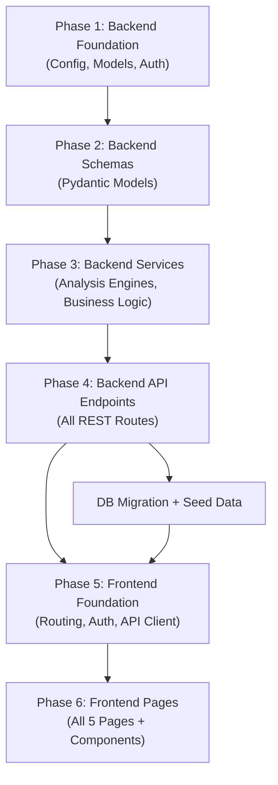

# AlphaMind — Full Implementation Plan

**Goal**: Build a complete NSE-focused stock intelligence platform per the [BRD](file:///C:/Users/adityachaturvedi/Downloads/BRD%201.0%20(5).pdf), combining technical and fundamental analysis into a transparent stock-ranking system for retail investors.

**Current State**: Backend is ~15% scaffolded (FastAPI skeleton + health endpoint). Frontend is 0% (default Vite template).

---

## User Review Required

> [!IMPORTANT]
> **API Prefix**: The existing backend uses `/api/v1/` but the BRD specifies `/api/`. I'll keep `/api/v1/` for proper versioning — the frontend will be configured to use this prefix. Let me know if you prefer `/api/` instead.

> [!IMPORTANT]
> **Database**: The plan assumes PostgreSQL is already running locally at `localhost:5432` with database `alphamind` and the credentials in your `.env`. Please confirm this is ready.

> [!WARNING]
> **yfinance for NSE stocks**: NSE symbols in yfinance use the `.NS` suffix (e.g., `TCS.NS`, `RELIANCE.NS`). The backend will automatically append `.NS` if not present. This means users can search for `TCS` and we'll query `TCS.NS`.

> [!IMPORTANT]
> **Tailwind CSS v4**: Your frontend already has Tailwind v4 configured. The BRD specifies Tailwind CSS, so I'll use it as requested (rather than vanilla CSS). This aligns with your existing setup.

## Open Questions

1. **Admin seed user** — Should I create a seed script that inserts a default admin user (e.g., `admin@alphamind.com` / `admin123`) so you can log in immediately? *(I'll do this by default unless you say no.)*
2. **Rate per search** — BRD says ₹20/search. Should this be configurable via admin panel, or fixed for now?
3. **Stock data caching** — Should we cache yfinance results in the DB (to avoid re-fetching for the same stock within a short period), or always fetch live? I recommend a **1-hour cache** to reduce API calls.
4. **Registration** — The BRD mentions user registration but only shows a Login page wireframe. Should users self-register, or should only admins create accounts?

---

## Proposed Changes

### Phase 1: Backend Foundation (Config, Models, Auth)

Sets up the core infrastructure — configuration, database models, security utilities, and the DB dependency injection pattern.

---

#### [MODIFY] [config.py](file:///c:/Users/adityachaturvedi/Desktop/alphamind-ai/backend/app/core/config.py)

Expand settings to include all required configuration:
- `DATABASE_URL` (from env)
- `SECRET_KEY` for JWT signing
- `ACCESS_TOKEN_EXPIRE_MINUTES` (default: 30)
- `CORS_ORIGINS` (list, default: `["http://localhost:5173"]`)
- `RATE_PER_SEARCH` (default: 20.0 — ₹20)
- `INVOICE_DIR` (default: `./invoices`)

#### [NEW] [security.py](file:///c:/Users/adityachaturvedi/Desktop/alphamind-ai/backend/app/core/security.py)

JWT and password utilities:
- `hash_password(password) -> str` — bcrypt hashing
- `verify_password(plain, hashed) -> bool` — bcrypt verification
- `create_access_token(data, expires_delta) -> str` — JWT creation with `python-jose`
- `decode_access_token(token) -> dict` — JWT decoding

#### [NEW] [dependencies.py](file:///c:/Users/adityachaturvedi/Desktop/alphamind-ai/backend/app/core/dependencies.py)

FastAPI dependency functions:
- `get_db()` — yields a SQLAlchemy session
- `get_current_user(token)` — extracts user from JWT Bearer token
- `get_admin_user(current_user)` — validates user has admin role

#### [MODIFY] [session.py](file:///c:/Users/adityachaturvedi/Desktop/alphamind-ai/backend/app/db/session.py)

Refactor to use `settings.DATABASE_URL` from config instead of raw `dotenv`.

#### [NEW] [user.py](file:///c:/Users/adityachaturvedi/Desktop/alphamind-ai/backend/app/models/user.py)

```python
class User(Base):
    id: int (PK, auto-increment)
    username: str (unique, not null)
    email: str (unique, not null)
    password_hash: str (not null)
    role: str (default="user")  # "user" or "admin"
    is_active: bool (default=True)
    created_at: datetime
```

#### [NEW] [search_history.py](file:///c:/Users/adityachaturvedi/Desktop/alphamind-ai/backend/app/models/search_history.py)

```python
class SearchHistory(Base):
    id: int (PK, auto-increment)
    user_id: int (FK -> users.id)
    stock_symbol: str (not null)
    stock_name: str
    technical_score: float
    fundamental_score: float
    final_score: float
    recommendation: str
    searched_at: datetime (default=now)
```

#### [NEW] [invoice.py](file:///c:/Users/adityachaturvedi/Desktop/alphamind-ai/backend/app/models/invoice.py)

```python
class Invoice(Base):
    id: int (PK, auto-increment)
    user_id: int (FK -> users.id)
    invoice_number: str (unique, not null)
    total_searches: int
    amount: float
    invoice_date: datetime (default=now)
    pdf_path: str (nullable)
```

#### [DELETE] [stock.py](file:///c:/Users/adityachaturvedi/Desktop/alphamind-ai/backend/app/models/stock.py)

The existing `Stock` model stores static stock info. Per the BRD, stock data is fetched live from yfinance — no persistent stock table needed. Remove this model.

#### [MODIFY] [__init__.py](file:///c:/Users/adityachaturvedi/Desktop/alphamind-ai/backend/app/models/__init__.py)

Update to import `User`, `SearchHistory`, `Invoice` (remove `Stock` import).

#### [MODIFY] [main.py](file:///c:/Users/adityachaturvedi/Desktop/alphamind-ai/backend/app/main.py)

- Add CORS middleware with configurable origins
- Include all API routers (auth, users, stocks, history, invoices)
- Add startup event to create `invoices/` directory

---

### Phase 2: Backend Schemas (Pydantic Models)

Request/response validation models for all endpoints.

---

#### [NEW] [auth.py](file:///c:/Users/adityachaturvedi/Desktop/alphamind-ai/backend/app/schemas/auth.py)

- `LoginRequest(email, password)`
- `TokenResponse(access_token, token_type)`
- `UserInfo(id, username, email, role, is_active)`

#### [NEW] [user.py](file:///c:/Users/adityachaturvedi/Desktop/alphamind-ai/backend/app/schemas/user.py)

- `UserCreate(username, email, password, role?)`
- `UserUpdate(username?, email?, password?, role?, is_active?)`
- `UserResponse(id, username, email, role, is_active, created_at)`

#### [NEW] [stock.py](file:///c:/Users/adityachaturvedi/Desktop/alphamind-ai/backend/app/schemas/stock.py)

- `TechnicalAnalysis(rsi, rsi_score, sma_trend, sma_score, momentum, momentum_score, volume_trend, volume_score, technical_score, strength)`
- `FundamentalAnalysis(roe, roe_score, debt_to_equity, de_score, revenue_growth, rg_score, eps_growth, eps_score, fundamental_score, strength)`
- `StockAnalysisResponse(symbol, company_name, sector, current_price, technical, fundamental, final_score, recommendation, rank_label)`

#### [NEW] [history.py](file:///c:/Users/adityachaturvedi/Desktop/alphamind-ai/backend/app/schemas/history.py)

- `SearchHistoryResponse(id, stock_symbol, stock_name, technical_score, fundamental_score, final_score, recommendation, searched_at)`

#### [NEW] [invoice.py](file:///c:/Users/adityachaturvedi/Desktop/alphamind-ai/backend/app/schemas/invoice.py)

- `InvoiceResponse(id, user_id, invoice_number, total_searches, amount, invoice_date, pdf_path)`
- `InvoiceGenerateResponse(invoice, message)`

---

### Phase 3: Backend Services (Business Logic)

The core analysis engines and business logic layer.

---

#### [NEW] [auth_service.py](file:///c:/Users/adityachaturvedi/Desktop/alphamind-ai/backend/app/services/auth_service.py)

- `authenticate_user(db, email, password) -> User | None`
- `create_token_for_user(user) -> str`

#### [NEW] [user_service.py](file:///c:/Users/adityachaturvedi/Desktop/alphamind-ai/backend/app/services/user_service.py)

- `create_user(db, data) -> User`
- `get_users(db) -> list[User]`
- `get_user_by_id(db, id) -> User`
- `update_user(db, id, data) -> User`
- `delete_user(db, id) -> None`

#### [NEW] [technical_analysis_service.py](file:///c:/Users/adityachaturvedi/Desktop/alphamind-ai/backend/app/services/technical_analysis_service.py)

Implements the Technical Analysis Engine (40% weight):
- **RSI (25%)** — 14-period RSI. Score: RSI 30-70 is optimal (score 100 at 50, declining toward extremes)
- **SMA 50 vs SMA 200 (30%)** — Golden cross = 100, death cross = 0, proximity scoring in between
- **Price Momentum (25%)** — 6-month price change percentage, normalized to 0-100
- **Volume Trend (20%)** — 20-day avg volume vs 50-day avg volume ratio

Input: 1 year of daily OHLCV data from yfinance  
Output: `TechnicalAnalysis` schema with individual KPI scores + weighted total

#### [NEW] [fundamental_analysis_service.py](file:///c:/Users/adityachaturvedi/Desktop/alphamind-ai/backend/app/services/fundamental_analysis_service.py)

Implements the Fundamental Analysis Engine (60% weight):
- **ROE (30%)** — Normalize: >20% = 100, <0% = 0, linear in between
- **Debt-to-Equity (25%)** — Normalize: 0 = 100, >2 = 0, inverse linear
- **Revenue Growth (20%)** — Normalize: >30% = 100, <-10% = 0, linear
- **EPS Growth (25%)** — Normalize: >30% = 100, <-10% = 0, linear

Input: Company financial data from yfinance `.info` and `.financials`  
Output: `FundamentalAnalysis` schema with individual KPI scores + weighted total

#### [NEW] [ranking_service.py](file:///c:/Users/adityachaturvedi/Desktop/alphamind-ai/backend/app/services/ranking_service.py)

- `calculate_final_score(tech_score, fund_score) -> float` — `0.6 × fundamental + 0.4 × technical`
- `get_recommendation(score) -> str` — Maps score to: Strong Buy (85-100), Buy (70-84), Hold (55-69), Weak (40-54), Avoid (0-39)

#### [NEW] [stock_service.py](file:///c:/Users/adityachaturvedi/Desktop/alphamind-ai/backend/app/services/stock_service.py)

Orchestrates the full analysis pipeline:
1. Fetch data from yfinance (append `.NS` for NSE stocks)
2. Run `TechnicalAnalysisService`
3. Run `FundamentalAnalysisService`
4. Run `RankingService`
5. Return combined `StockAnalysisResponse`

#### [NEW] [history_service.py](file:///c:/Users/adityachaturvedi/Desktop/alphamind-ai/backend/app/services/history_service.py)

- `save_search(db, user_id, analysis_result) -> SearchHistory`
- `get_user_history(db, user_id) -> list[SearchHistory]`
- `get_all_history(db) -> list[SearchHistory]`
- `get_search_count(db, user_id) -> int`

#### [NEW] [invoice_service.py](file:///c:/Users/adityachaturvedi/Desktop/alphamind-ai/backend/app/services/invoice_service.py)

- `generate_invoice(db, user_id, rate_per_search) -> Invoice`
  - Counts unbilled searches
  - Calculates amount = count × rate
  - Generates unique invoice number (e.g., `INV-2026-0001`)
  - Creates invoice record
- `get_invoices(db) -> list[Invoice]`
- `get_invoice_by_id(db, id) -> Invoice`

#### [NEW] [pdf_generator.py](file:///c:/Users/adityachaturvedi/Desktop/alphamind-ai/backend/app/utils/pdf_generator.py)

Uses **ReportLab** to generate professional PDF invoices:
- AlphaMind branding/header
- User details, invoice number, date
- Search breakdown table
- Total amount
- Saves to `invoices/` directory, updates `Invoice.pdf_path`

---

### Phase 4: Backend API Endpoints

All REST endpoints per the BRD.

---

#### [NEW] [auth.py](file:///c:/Users/adityachaturvedi/Desktop/alphamind-ai/backend/app/api/v1/endpoints/auth.py)

| Method | Path | Description | Auth |
|--------|------|-------------|------|
| `POST` | `/auth/login` | Login with email+password, returns JWT | Public |
| `GET` | `/auth/me` | Get current user info from token | JWT |

#### [NEW] [users.py](file:///c:/Users/adityachaturvedi/Desktop/alphamind-ai/backend/app/api/v1/endpoints/users.py)

| Method | Path | Description | Auth |
|--------|------|-------------|------|
| `POST` | `/users` | Create new user | Admin |
| `GET` | `/users` | List all users | Admin |
| `GET` | `/users/{id}` | Get user details | Admin |
| `PUT` | `/users/{id}` | Update user | Admin |
| `DELETE` | `/users/{id}` | Delete user | Admin |

#### [NEW] [stocks.py](file:///c:/Users/adityachaturvedi/Desktop/alphamind-ai/backend/app/api/v1/endpoints/stocks.py)

| Method | Path | Description | Auth |
|--------|------|-------------|------|
| `GET` | `/stocks/analyze/{symbol}` | Full analysis + saves to search history | JWT |
| `GET` | `/stocks/details/{symbol}` | Quick stock info (no analysis) | JWT |

#### [NEW] [history.py](file:///c:/Users/adityachaturvedi/Desktop/alphamind-ai/backend/app/api/v1/endpoints/history.py)

| Method | Path | Description | Auth |
|--------|------|-------------|------|
| `GET` | `/history` | Current user's search history | JWT |
| `GET` | `/history/user/{user_id}` | Specific user's history | Admin |

#### [NEW] [invoices.py](file:///c:/Users/adityachaturvedi/Desktop/alphamind-ai/backend/app/api/v1/endpoints/invoices.py)

| Method | Path | Description | Auth |
|--------|------|-------------|------|
| `POST` | `/invoices/generate/{user_id}` | Generate invoice for user | Admin |
| `GET` | `/invoices` | List all invoices | Admin |
| `GET` | `/invoices/{invoice_id}` | Get invoice details | Admin |
| `GET` | `/invoices/download/{invoice_id}` | Download invoice PDF | Admin |

#### [MODIFY] [router.py](file:///c:/Users/adityachaturvedi/Desktop/alphamind-ai/backend/app/api/v1/router.py)

Include all new endpoint routers (auth, users, stocks, history, invoices) alongside existing health router.

#### [NEW] [seed.py](file:///c:/Users/adityachaturvedi/Desktop/alphamind-ai/backend/app/utils/seed.py)

Database seeder script:
- Creates default admin: `admin@alphamind.com` / `admin123` (role=admin)
- Creates a demo user: `user@alphamind.com` / `user123` (role=user)
- Idempotent (skips if users exist)

#### [NEW] [requirements.txt](file:///c:/Users/adityachaturvedi/Desktop/alphamind-ai/backend/requirements.txt)

```
fastapi
uvicorn[standard]
sqlalchemy
psycopg2-binary
pydantic-settings
python-dotenv
python-jose[cryptography]
passlib[bcrypt]
alembic
yfinance
pandas
numpy
reportlab
```

---

### Phase 5: Frontend Foundation

Core infrastructure: routing, auth state, layout, API client.

---

#### [MODIFY] [index.html](file:///c:/Users/adityachaturvedi/Desktop/alphamind-ai/frontend/index.html)

- Update `<title>` to "AlphaMind — Stock Intelligence Platform"
- Add meta description for SEO
- Add Google Fonts link (Inter)

#### [MODIFY] [index.css](file:///c:/Users/adityachaturvedi/Desktop/alphamind-ai/frontend/src/index.css)

Complete redesign with AlphaMind design system using Tailwind v4:
- Dark theme as primary (deep navy/slate backgrounds)
- Accent colors: Electric blue (`#3B82F6`), Emerald green for positive (`#10B981`), Red for negative (`#EF4444`)
- Custom CSS variables for the color palette
- Inter font family
- Smooth transitions and glassmorphism utilities
- Score gauge animations

#### [MODIFY] [App.tsx](file:///c:/Users/adityachaturvedi/Desktop/alphamind-ai/frontend/src/App.tsx)

Replace Vite boilerplate with:
- `BrowserRouter` wrapping
- `AuthProvider` context
- Route definitions for all 5 pages
- `ProtectedRoute` and `AdminRoute` wrappers

#### [MODIFY] [main.tsx](file:///c:/Users/adityachaturvedi/Desktop/alphamind-ai/frontend/src/main.tsx)

Keep as is (already correct for React 19).

#### [NEW] [api.ts](file:///c:/Users/adityachaturvedi/Desktop/alphamind-ai/frontend/src/services/api.ts)

Axios instance:
- `baseURL: "/api/v1"`
- Request interceptor: attach JWT from localStorage
- Response interceptor: handle 401 → redirect to login
- Vite proxy config will forward `/api` to `http://localhost:8000`

#### [NEW] [authService.ts](file:///c:/Users/adityachaturvedi/Desktop/alphamind-ai/frontend/src/services/authService.ts)

- `login(email, password)` → POST `/auth/login`
- `getMe()` → GET `/auth/me`
- `logout()` → clear token + redirect

#### [NEW] [stockService.ts](file:///c:/Users/adityachaturvedi/Desktop/alphamind-ai/frontend/src/services/stockService.ts)

- `analyzeStock(symbol)` → GET `/stocks/analyze/{symbol}`
- `getStockDetails(symbol)` → GET `/stocks/details/{symbol}`

#### [NEW] [userService.ts](file:///c:/Users/adityachaturvedi/Desktop/alphamind-ai/frontend/src/services/userService.ts)

- `getUsers()`, `createUser(data)`, `updateUser(id, data)`, `deleteUser(id)`

#### [NEW] [historyService.ts](file:///c:/Users/adityachaturvedi/Desktop/alphamind-ai/frontend/src/services/historyService.ts)

- `getMyHistory()`, `getUserHistory(userId)`

#### [NEW] [invoiceService.ts](file:///c:/Users/adityachaturvedi/Desktop/alphamind-ai/frontend/src/services/invoiceService.ts)

- `generateInvoice(userId)`, `getInvoices()`, `getInvoice(id)`, `downloadInvoice(id)`

#### [NEW] [AuthContext.tsx](file:///c:/Users/adityachaturvedi/Desktop/alphamind-ai/frontend/src/context/AuthContext.tsx)

React context providing:
- `user` (current user object or null)
- `isAuthenticated` (boolean)
- `isAdmin` (boolean)
- `login(email, password)` — calls API, stores token, fetches user
- `logout()` — clears state + token

#### [NEW] [types/](file:///c:/Users/adityachaturvedi/Desktop/alphamind-ai/frontend/src/types/)

TypeScript interfaces matching backend schemas:
- `types/auth.ts` — `LoginRequest`, `TokenResponse`, `User`
- `types/stock.ts` — `TechnicalAnalysis`, `FundamentalAnalysis`, `StockAnalysisResponse`
- `types/invoice.ts` — `Invoice`
- `types/history.ts` — `SearchHistoryItem`

#### [NEW] [ProtectedRoute.tsx](file:///c:/Users/adityachaturvedi/Desktop/alphamind-ai/frontend/src/components/ProtectedRoute.tsx)

Redirects to `/login` if not authenticated. Wraps user routes.

#### [NEW] [AdminRoute.tsx](file:///c:/Users/adityachaturvedi/Desktop/alphamind-ai/frontend/src/components/AdminRoute.tsx)

Redirects to `/dashboard` if not admin. Wraps admin routes.

#### [MODIFY] [vite.config.ts](file:///c:/Users/adityachaturvedi/Desktop/alphamind-ai/frontend/vite.config.ts)

Add dev server proxy:
```ts
server: {
  proxy: {
    '/api': 'http://localhost:8000'
  }
}
```

---

### Phase 6: Frontend Pages & Components

All 5 pages with premium UI design.

---

#### [NEW] [Navbar.tsx](file:///c:/Users/adityachaturvedi/Desktop/alphamind-ai/frontend/src/components/layout/Navbar.tsx)

Top navigation bar:
- AlphaMind logo + brand name
- Navigation links (Dashboard, History — user; Users, Invoices — admin)
- User profile dropdown with name, role badge, logout
- Glassmorphism background with blur effect

#### [NEW] [ScoreGauge.tsx](file:///c:/Users/adityachaturvedi/Desktop/alphamind-ai/frontend/src/components/common/ScoreGauge.tsx)

Animated circular score gauge (0-100) with color gradient:
- Green (85-100), Blue (70-84), Yellow (55-69), Orange (40-54), Red (0-39)
- Smooth CSS animation on mount
- Used for Technical, Fundamental, and Final scores

#### [NEW] [LoadingSpinner.tsx](file:///c:/Users/adityachaturvedi/Desktop/alphamind-ai/frontend/src/components/common/LoadingSpinner.tsx)

Full-screen and inline loading states with AlphaMind branding.

#### [NEW] [LoginPage.tsx](file:///c:/Users/adityachaturvedi/Desktop/alphamind-ai/frontend/src/pages/LoginPage.tsx)

Premium login page:
- Centered card with glassmorphism effect on dark gradient background
- AlphaMind logo and tagline
- Email + password fields with validation
- Login button with loading state
- Error message display with animations
- Role-based redirect after login (admin → `/admin`, user → `/dashboard`)

#### [NEW] [UserDashboard.tsx](file:///c:/Users/adityachaturvedi/Desktop/alphamind-ai/frontend/src/pages/UserDashboard.tsx)

Main user landing page:
- **Stock Search Bar** — prominent search input with autocomplete-style UX, "Analyze" button
- **Quick Stats Cards** — total searches, last analyzed stock, account status
- **Recent Searches Table** — last 10 searches with scores, recommendations, click to view
- **Quick Recommendations** — color-coded recommendation badges

#### [NEW] [StockAnalysisPage.tsx](file:///c:/Users/adityachaturvedi/Desktop/alphamind-ai/frontend/src/pages/StockAnalysisPage.tsx)

The core analysis results page:
- **Stock Header** — symbol, company name, sector, current price
- **Score Gauges Row** — 3 animated circular gauges (Technical, Fundamental, Final)
- **Technical Analysis Card** — RSI, SMA 50/200, Momentum, Volume Trend with individual scores and progress bars
- **Fundamental Analysis Card** — ROE, D/E, Revenue Growth, EPS Growth with individual scores and progress bars
- **Recommendation Banner** — large color-coded recommendation (Strong Buy → Avoid)
- **Back to Dashboard** button
- Loading state while analysis is running (yfinance fetch can take a few seconds)

#### [NEW] [AdminDashboard.tsx](file:///c:/Users/adityachaturvedi/Desktop/alphamind-ai/frontend/src/pages/AdminDashboard.tsx)

Admin control panel:
- **Stats Overview** — total users, active users, total searches, total revenue (cards with icons)
- **User Management Table** — sortable table with username, email, role, status, search count, actions
- **Create User Modal** — form to add new users (username, email, password, role)
- **Edit User Modal** — update user details
- **Delete Confirmation Modal** — with warning
- **Generate Invoice Button** per user row

#### [NEW] [InvoiceManagementPage.tsx](file:///c:/Users/adityachaturvedi/Desktop/alphamind-ai/frontend/src/pages/InvoiceManagementPage.tsx)

Invoice admin page:
- **User Selection** — dropdown to select user
- **User Info Card** — shows selected user's details and search statistics
- **Invoice Preview** — calculates amount (searches × ₹20)
- **Generate Invoice Button** — creates invoice + PDF
- **Invoice History Table** — all invoices with number, user, amount, date, download button
- **PDF Download** — direct download link for generated PDFs

---

## Verification Plan

### Automated Tests

```bash
# Backend: Run the server
cd backend && python -m uvicorn app.main:app --reload

# Backend: Test health endpoint
curl http://localhost:8000/api/v1/health/

# Backend: Test login
curl -X POST http://localhost:8000/api/v1/auth/login -H "Content-Type: application/json" -d '{"email":"admin@alphamind.com","password":"admin123"}'

# Backend: Test stock analysis (with token)
curl http://localhost:8000/api/v1/stocks/analyze/TCS -H "Authorization: Bearer <token>"

# Frontend: Start dev server
cd frontend && npm run dev

# Database: Generate and run migrations
cd backend && alembic revision --autogenerate -m "initial" && alembic upgrade head
```

### Manual Verification

1. **Login Flow** — Login as admin and user, verify role-based routing
2. **Stock Analysis** — Search for `TCS`, `RELIANCE`, `INFY` — verify scores and recommendations render correctly
3. **Admin User CRUD** — Create, edit, delete users from admin panel
4. **Invoice Generation** — Generate invoice for a user, download PDF, verify contents
5. **Search History** — Verify searches are tracked and displayed on dashboard
6. **Responsive Design** — Check all pages at different viewport sizes
7. **Error Handling** — Test with invalid stock symbols, wrong credentials, network errors

---

## Execution Order



**Estimated Files**: ~40 new files, ~8 modified files, 1 deleted file
